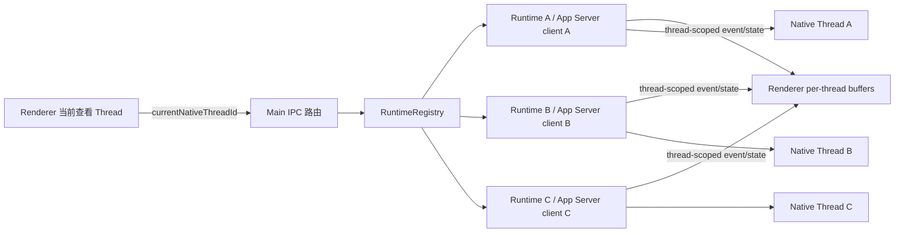

# STAGE A：Multi-Thread Runtime / Writer Conflict

日期：2026-08-18
项目：`D:\办公\AI\Codex_Workbench_V1`
基线：`73f8860 fix: stabilize project thread creation lifecycle`
范围：Workbench V1 的 Native Thread Runtime 隔离与同 Thread writer conflict 处理

## 1. 阶段结论

STAGE A 已完成实现和机器验证，当前提交 GPT 阶段审查。实现没有进入 STAGE B，也没有修改旧项目 `D:\办公\AI\Codex_Workbench`。

原问题是 Workbench 只有一个全局 active runtime：切换 Thread B 时会关闭 Thread A 的 App Server client；Renderer 还会在 Turn 运行时阻止切换和新建 Thread。这样既不能后台并行，也无法安全地观察多个 Native Thread 的状态。

本阶段改为“一个 Native Thread 一个 Runtime，一个 UI 当前选择指针”：切换只改变当前查看对象，不关闭其他 Thread 的 Runtime；Turn、interrupt、Approval 都带目标 `nativeThreadId`；后台事件和状态按 Thread 保存；同一 Thread 的重复 Runtime 不会覆盖已有实例。

## 2. 目标架构



关键不变量：

1. `RuntimeRegistry<nativeThreadId>` 中同一 Native Thread 至多有一个 Workbench Runtime。
2. UI 的当前选择不等于“唯一正在运行的 Runtime”。
3. 选择 B 不会关闭 A；A 的进程、Turn 和事件继续独立运行。
4. `turn/start`、`turn/interrupt`、Approval response 必须显式使用目标 Thread。
5. writer conflict 保留原 Thread ID，不抢锁、不自动换 Thread、不伪造新的上下文。
6. 不在 Workbench 增加固定并发上限，资源限制交由 Codex/App Server 返回。

## 3. 实现内容

### 3.1 Main Runtime Registry

新增 `src/main/runtime-registry.ts`：

- `Map<nativeThreadId, NativeThreadRuntime>` 保存所有已加载 Runtime。
- `ensure()` 对同一 Thread 的并发加载去重，避免重复启动两个 App Server writer。
- `attach()` 遇到同 ID 的不同 Runtime 返回 `RUNTIME_DUPLICATE`，不覆盖已有实例。
- `close()` 只关闭指定 Thread；`closeAll()` 等待已登记和正在启动的 Runtime 一起收尾。
- Registry 不主动限制 A/B/C 的并发数量。

`src/main/main.ts` 的变化：

- 移除单一全局 `runtime`，保留独立 `currentNativeThreadId`。
- `switchNativeThread()` 只加载/选择目标 Runtime，不再关闭当前 Runtime。
- `createNativeThread()` 只创建并 attach 新 Runtime，不再破坏旧 Runtime。
- 每个 Runtime 的事件、状态和 process exit 都发送给 Renderer；Renderer 决定是否显示在当前视图。
- Main Approval key 改为 `(nativeThreadId, rpcId)`，并在状态消息中带 Thread ID。
- 退出时关闭整个 Registry，避免后台 Runtime 残留。

### 3.2 Native Runtime 同 Thread 保护

`src/codex/native-thread-runtime.ts` 增加了 `stateValue === TURN_RUNNING/WAITING_USER` 的并发保护。这样在 `turn/start` 已进入运行状态但原生 Turn ID 尚未返回的窄窗口内，第二个 `turn/start`、Thread 创建或切换也会被拒绝，不会因为只检查 `activeTurnId` 而绕过保护。

### 3.3 Renderer Thread-scoped 状态与事件

`src/renderer/renderer.ts` 改为维护：

- `runtimeStates: Map<nativeThreadId, RuntimeSnapshot>`：侧边栏显示后台 Thread 的运行中/启动中/失败状态。
- `liveEventsByThread`：后台事件不再丢弃，切回 Thread 后仍可显示。
- `pendingApprovalsByThread`：Approval 不再只使用 RPC ID，避免不同 Thread 的同号请求互相覆盖。
- `turnOperationThreads`：只锁住正在发送 Turn 的 Thread，不锁整个 Workbench。

Thread 切换和新建不再因其他 Thread 正在 Turn 而被拦截。切换失败时恢复原选择、原 projection 和原视图，避免错误结果覆盖旧 Thread。

### 3.4 Writer Conflict

`src/shared/error-info.ts` 新增 `isWriterConflictError()`：仅将包含 `thread-store conflict` / `already has an active writer` 的 `APP_SERVER_PROTOCOL_REJECTED` 归类为 `WRITER_CONFLICT`，其他协议错误保持原始 code。

Renderer 新增专用对话框：

> 当前对话正在被另一个 Codex 客户端使用。请关闭另一客户端中的该对话后重试。

原始错误仍保存在 `cause/stderr` 中；不会删除 Native Thread binding，不会自动创建替代 Thread，也不会把其他 Thread 关闭。

## 4. 变更文件

产品代码：

- `src/main/runtime-registry.ts`
- `src/main/main.ts`
- `src/codex/native-thread-runtime.ts`
- `src/preload/preload.cts`
- `src/renderer/renderer.ts`
- `src/renderer/index.html`
- `src/shared/error-info.ts`
- `package.json`

验证代码：

- `tests/runtime-registry.test.ts`
- `tests/error-info.test.ts`
- `tests/native-thread-runtime.test.ts`
- `scripts/real-multi-thread-runtime-smoke.ts`

文档：

- `docs/STAGE-A-MULTI-THREAD-RUNTIME.md`

本阶段没有修改旧 donor 项目，也没有纳入用户已有的 `V1docs.zip` 和 `导航文档/Workbench_V1_人工验收范围与后续计划_2026-08-18_v1.1.docx`。

## 5. 自动化证据

以下命令均在 `D:\办公\AI\Codex_Workbench_V1` 执行：

| 检查 | 结果 | 证据 |
|---|---|---|
| `npm run check` | PASS | TypeScript 产品代码、测试和 smoke 脚本均通过类型检查 |
| `npm test` | PASS | 60/60 tests pass |
| `npm run build` | PASS | `BUILD PASS` |
| `npm run test:real:navigation` | PASS | 真实 App Server 创建 Project Thread、Standalone Thread、切换和重启恢复 |
| `npm run test:real:workspace` | PASS | 真实 App Server Turn 中断、继续、读取和重启恢复 |
| `npm run test:real:multi-thread` | PASS | 两个真实 Runtime 并行启动两个 Native Thread、并行完成 Turn、事件 Thread ID 全部匹配 |
| `git diff --check` | PASS | 无 whitespace 错误；仅有 Git 的 LF/CRLF 提示 |

双 Runtime 真实 smoke 的关键断言：

- A/B 生成不同 Native Thread ID。
- A/B 的 Turn 同时完成，返回的 `nativeThreadId` 与各自启动 ID 相同。
- A 的 `turn/started` / `turn/completed` 事件只包含 A ID；B 同理。
- 测试结束后关闭 Runtime 并调用 `thread/delete` 清理临时 Native Thread。

## 6. 人工验收建议

这些项目依赖 Electron Renderer 和真实 UI，当前自动化没有替代人工操作：

1. 打开 Workbench，创建 Thread A，发送一个较长任务；在 A 运行时点击新建 Thread 或切换已有 Thread B，确认不会出现“当前 Turn 运行中不能切换”，A 仍显示运行中。
2. 在 B 发送消息，切回 A，确认 A/B 的标题、Native ID、Turn/Item 不串线；侧边栏能分别显示运行中/就绪。
3. A、B 都运行时，在 B 点击“停止”，确认只中断 B，A 继续运行。
4. 让 A 产生 Approval，再切换 B；确认 Approval 仍归属于 A，回到 A 后可操作，不会被 B 的同号 RPC 覆盖。
5. 用 Codex Desktop 打开同一个 Native Thread，再在 Workbench 对该 Thread 发送；确认出现 writer-conflict 对话框，Thread ID 不变、不新建替代 Thread。关闭另一个客户端后重试应可恢复。
6. 关闭并重新打开 Workbench，确认最后选择的 Thread 可以恢复；其他已运行 Thread 的清理不应导致崩溃。

## 7. 已知边界

- Codex/App Server 自身的资源、网络、TLS、代理和模型限制仍可能使单个 Runtime 失败；Registry 不吞掉这些原始错误。
- 本阶段没有把 App Server 切换成 Workbench 的生产默认架构；仍沿用当前 Native Runtime / App Server 协议链路。
- Electron Main/Renderer IPC 的完整集成测试仍需要人工验收配合；核心 Runtime、Registry、错误分类和真实 CLI 已有自动化证据。
- Project Map maintenance Runtime 继续由现有 `ProjectMapManager` 独立管理，本阶段没有把它混入普通 Thread Registry。
- 不对后台 Runtime 强行设置并发上限；若真实 Codex 返回资源错误，应按原始错误处理。

## 8. 阶段审查请求

请 GPT 审查本报告、代码变更和自动化证据，并返回 `PASS`、`FIX`、`REDESIGN` 或 `BLOCKED`。收到结果后只按审查结果推进；本阶段审查通过前不进入 STAGE B。

```text
[CODEX_WORKBENCH_STAGE_REVIEW]
stage: STAGE-A-MULTI-THREAD-RUNTIME
status: PASS
product_code_changed: YES
workdir: D:\办公\AI\Codex_Workbench_V1
base_commit: 73f8860
check: PASS (npm run check)
unit_tests: PASS (60/60)
build: PASS (npm run build)
real_navigation_smoke: PASS
real_workspace_smoke: PASS
real_multi_thread_smoke: PASS
writer_conflict_classification: PASS
thread_scoped_renderer_buffers: IMPLEMENTED
main_runtime_registry: IMPLEMENTED
blockers: none for automated validation
manual_validation_needed: Electron UI switching/background status/Approval and same-thread writer conflict modal
next_step: WAIT_FOR_GPT_REVIEW
```
