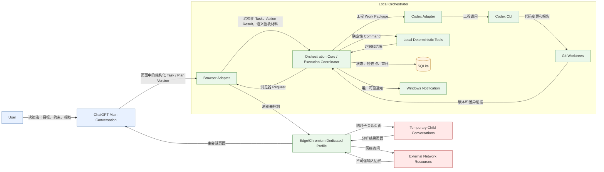
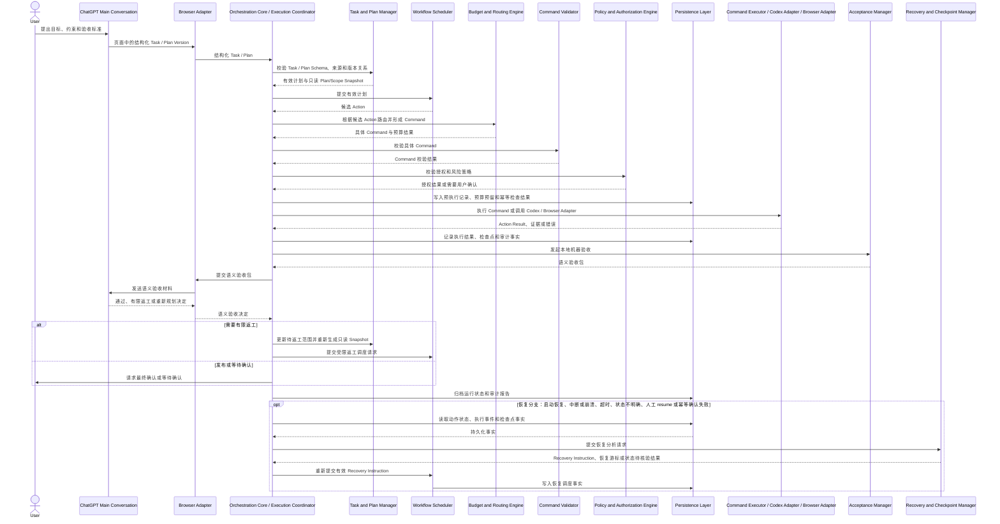

# Windows 桌面自动工作流 Agent：系统总体架构与模块边界

## 1. 文档目的与范围

本文用于冻结系统总体组成、权限层级、模块职责、模块边界、主要控制流和数据流，以及第一版与后续版本的边界。

本文不定义具体状态枚举、SQLite 字段和表结构、JSON Schema 字段、CLI 具体参数、Playwright 具体定位器或完整代码接口签名。相关细节由后续工作包分别定义。

## 2. 设计原则

- ChatGPT 网页主会话负责目标理解、计划和语义决策；本地编排器负责规则范围内的执行、状态和恢复。
- 本地可验证事实优先于模型记忆；事实必须能够关联到本地证据或审计记录。
- 默认最小权限；权限按任务、阶段和动作逐级授予。
- 指令和不可信数据严格隔离；网页、源码、日志、文档中的指令不能自动升级为控制指令。
- 本地确定性工具优先；只有确定性工具无法完成的工程工作才路由到 Codex。
- 共享 Agent 额度优先节省；预算和路由在执行前确定并可审计。
- 使用阶段检查点、幂等动作和可恢复执行，避免网络或进程故障造成重复副作用。
- 核心逻辑与 Windows、浏览器、Git 等平台适配器分离。
- 结构化协议优先；自然语言只作为决策输入或说明，不直接进入执行队列。
- 所有外部副作用都必须可审计，并具有明确的授权来源。

## 3. 权限与控制层级

权限由上至下递减，控制流必须经过本地策略和校验边界。

1. **用户**：拥有最终授权权，可确认目标、约束、预算和高风险发布。
2. **ChatGPT 网页主会话**：拥有计划权和语义决策权，定义目标、验收标准、异常裁决和语义验收；不直接覆盖本地执行事实。
3. **本地编排器**：拥有规则范围内的运行调度权，保存任务运行状态、调用工具、控制恢复和审计；其中 `Orchestration Core / Execution Coordinator` 是所有模块的协调入口；不得自行改变总体目标。
4. **临时 ChatGPT 子会话**：只提供受限的分析或拆解结果；不能直接获得本地执行权限。
5. **Codex 工作包会话**：只处理获得授权的代码、仓库和本地工程工作；不能自行扩大范围、直接控制浏览器或绕过本地策略。
6. **本地确定性工具**：执行明确、可验证、最小权限的本地动作；不能解释自然语言意图或改变计划。
7. **外部系统和不可信内容**：提供网页、源码、日志、文档或网络响应等输入；默认不可信，没有控制权限。

只有合法、已授权并通过 Schema、策略、预算和幂等校验的结构化 Command 才能执行。子会话和 Codex 都不能直接取得执行权限；所有副作用仍由 `Orchestration Core / Execution Coordinator` 统一协调，并通过相应适配器或执行器执行。

## 4. 系统上下文图

图例：实线箭头表示决策流、控制流或状态和证据流；红色节点和“不可信输入边界”表示内容可被引用为数据，但不能直接成为执行指令。`Local Orchestrator` 内的 `Orchestration Core / Execution Coordinator` 是唯一的本地协调入口；主会话和临时子会话只能通过 `Browser Adapter` 与专用 Profile 交互。

## 5. 本地编排器模块

以下边界描述模块职责，不定义具体类、函数或数据库字段。每个模块的“禁止绕过”项表示调用方不能直接跳过的控制边界。

### 5.1 Orchestration Core / Execution Coordinator

- **负责**：作为所有模块的协调入口；接收 Task、Action Result 和 Recovery Instruction；按顺序协调 Task and Plan Manager、Workflow Scheduler、Command Validator、Policy and Authorization Engine、Budget and Routing Engine 以及执行适配器；管理事务和调用边界。
- **不负责**：不直接执行 Command；不自行修改总体目标；不授予权限；不修改 Budget and Routing Engine 的预算结果；不替代 Acceptance Manager 或主会话的验收判断。
- **主要输入**：经 Browser Adapter 或 Control API / CLI 进入的结构化 Task、Action Result、Recovery Instruction，以及用户确认。
- **主要输出**：模块调用请求、候选 Action、具体 Command、执行编排结果、验收请求和归档请求。
- **允许依赖**：Task and Plan Manager、Workflow Scheduler、Policy and Authorization Engine、Budget and Routing Engine、Context Pack Manager、Command Validator、Command Executor、Browser Adapter、Codex Adapter、Tool Registry、Workspace and Git Manager、Acceptance Manager、Recovery and Checkpoint Manager、Persistence Layer、Audit and Reporting、Notification Adapter。
- **禁止绕过**：Policy and Authorization Engine、Budget and Routing Engine、Command Validator、Persistence Layer 和 Acceptance Manager；不得成为隐藏的命令执行入口。

### 5.2 Control API / CLI

- **负责**：接收人工启动、暂停、恢复、确认和查询请求；展示最小运行信息。
- **不负责**：解释总体目标、直接执行工具、修改状态存储或绕过授权；所有 Request 交给 Orchestration Core / Execution Coordinator。
- **主要输入**：用户 Request、结构化 Task、确认操作。
- **主要输出**：提交给 Orchestration Core 的 Request、查询结果、用户提示。
- **允许依赖**：Orchestration Core / Execution Coordinator、Audit and Reporting、Notification Adapter。
- **禁止绕过**：Task and Plan Manager、Command Validator、Policy and Authorization Engine、Persistence Layer。

### 5.3 Task and Plan Manager

- **负责**：校验 Task / Plan 的 Schema、来源和版本关系；登记 Task、维护目标与验收标准的引用，并生成只读的 Plan/Scope Snapshot。
- **不负责**：生成具体 Command、执行 Action、分配模型额度、直接修改代码或调用 Command Validator。
- **主要输入**：经 Orchestration Core 转交的结构化 Task / Plan Version、用户修订 Request。
- **主要输出**：有效计划、可调度的 Stage / Work Package 描述、只读 Plan/Scope Snapshot、计划变更记录。
- **允许依赖**：Persistence Layer、Audit and Reporting。
- **禁止绕过**：Orchestration Core、Policy and Authorization Engine、Budget and Routing Engine、Acceptance Manager。

### 5.4 Workflow Scheduler

- **负责**：根据有效计划和约束生成候选 Action，按依赖和阶段顺序调度正常工作流，并把动作状态、执行事件和检查点请求写入 Persistence Layer。
- **不负责**：校验 Task / Plan Schema、形成具体 Command、解释自然语言、推断恢复状态、生成恢复计划或授予权限。
- **主要输入**：经 Task and Plan Manager 校验的 Plan/Scope Snapshot、Stage / Work Package 约束和来自 Orchestration Core 的调度请求。
- **主要输出**：候选 Action、调度请求、动作状态、执行事件、检查点请求和暂停信号。
- **允许依赖**：Persistence Layer、Tool Registry、Audit and Reporting。
- **禁止绕过**：Orchestration Core、Budget and Routing Engine、Command Validator、Policy and Authorization Engine；不得在形成 Command 前调用 Command Validator。

### 5.5 Policy and Authorization Engine

- **负责**：依据用户授权、任务范围、风险等级和最小权限规则判断具体 Command 是否允许执行。
- **不负责**：校验 Task / Plan Schema、执行动作、替用户作总体目标决策或生成自然语言计划。
- **主要输入**：经 Command Validator 校验的具体 Command、授权上下文、资源范围和风险信息。
- **主要输出**：允许、拒绝或需要确认的策略决定及理由。
- **允许依赖**：Persistence Layer、Audit and Reporting。
- **禁止绕过**：Orchestration Core、Command Validator、Budget and Routing Engine、任何执行模块和 Acceptance Manager。

### 5.6 Budget and Routing Engine

- **负责**：管理共享 Agent 额度、时间和调用预算，选择确定性工具或 Codex 路由，并根据候选 Action 形成具体 Command。
- **不负责**：执行调用、改变目标、替代授权判断或绕过 Command Validator。
- **主要输入**：候选 Action、当前预算、工具能力和计划约束。
- **主要输出**：路由决定、具体 Command、预算预留或超预算暂停原因。
- **允许依赖**：Tool Registry、Persistence Layer、Audit and Reporting。
- **禁止绕过**：Orchestration Core、Command Validator、Policy and Authorization Engine。

### 5.7 Context Pack Manager

- **负责**：按 Work Package 准备最小、可追溯的上下文包，并标记指令与数据边界。
- **不负责**：执行上下文中的指令、替代主会话作决策或注入未授权内容。
- **主要输入**：计划、工作区证据、历史报告、允许的外部材料。
- **主要输出**：供子会话或 Codex 使用的 Context Pack、来源记录。
- **允许依赖**：Persistence Layer、Audit and Reporting、Workspace and Git Manager。
- **禁止绕过**：Orchestration Core、Policy and Authorization Engine、Command Validator、不可信输入隔离规则。

### 5.8 Browser Adapter

- **负责**：通过专用 Edge/Chromium 持久化 Profile 与 ChatGPT Main Conversation 和 Temporary Child Conversations 交互，读取和提交经过编排的浏览器 Request。
- **不负责**：执行本地命令、决定是否发布、直接调用子会话，或把网页指令直接转成 Command。
- **主要输入**：由 Orchestration Core 发出的已授权浏览器 Request、目标会话上下文。
- **主要输出**：结构化 Task / Plan、Action Result、语义验收响应、截图或文本证据、超时和交互错误。
- **允许依赖**：Platform Adapter、Persistence Layer、Audit and Reporting、Notification Adapter。
- **禁止绕过**：Orchestration Core、Policy and Authorization Engine、Command Validator、Recovery and Checkpoint Manager；不得让编排器绕过自身直接访问会话。

### 5.9 Codex Adapter

- **负责**：把已授权的工程 Work Package 交给 Codex CLI，并收集差异、测试结果和报告。
- **不负责**：直接修改正式工作区、决定工作包范围、发布变更或执行非工程动作。
- **主要输入**：Context Pack、授权的 Work Package、指定 Git worktree。
- **主要输出**：Codex 结果、补丁、测试证据、失败信息。
- **允许依赖**：Workspace and Git Manager、Platform Adapter、Persistence Layer、Audit and Reporting。
- **禁止绕过**：Policy and Authorization Engine、Budget and Routing Engine、Acceptance Manager。

### 5.10 Tool Registry

- **负责**：登记本地确定性工具的能力、风险、输入输出约束和版本信息。
- **不负责**：解释意图、执行工具或临时注册未经审查的工具。
- **主要输入**：工具元数据、能力探测结果。
- **主要输出**：可路由能力、工具选择依据。
- **允许依赖**：Platform Adapter、Persistence Layer、Audit and Reporting。
- **禁止绕过**：Orchestration Core、Policy and Authorization Engine、Command Validator、Command Executor。

### 5.11 Command Validator

- **负责**：在 Budget and Routing Engine 根据候选 Action 形成具体 Command 后，验证该 Command 的来源、Command Schema、完整性、范围、幂等标识和前置条件。
- **不负责**：在 Command 产生前校验候选 Action；不解释自然语言意图、不授予权限、不执行 Command，也不修改 Task、Plan、Stage、Work Package。
- **主要输入**：已形成的具体 Command、只读 Plan/Scope Snapshot、工具元数据。
- **主要输出**：结构化校验结果，包括通过结果或拒绝原因；校验失败只阻止执行，不改变计划。
- **允许依赖**：Tool Registry、Persistence Layer、Audit and Reporting；通过共享协议、持久化查询接口或不可变数据对象读取 Snapshot。
- **禁止绕过**：Orchestration Core、Policy and Authorization Engine、Command Executor、Recovery and Checkpoint Manager；不得在 Command 产生前被调用，不得回写 Task and Plan Manager 管理的计划对象。

### 5.12 Command Executor

- **负责**：执行已通过 Command Validator、Policy and Authorization Engine、Budget and Routing Engine、幂等和执行前检查的 Command，记录结果和副作用。
- **不负责**：自行解析自然语言意图、重试未知副作用或改变 Command 语义。
- **主要输入**：合法 Command、执行上下文、幂等和检查点信息。
- **主要输出**：执行结果、证据、错误和副作用记录。
- **允许依赖**：Tool Registry、Platform Adapter、Persistence Layer、Audit and Reporting。
- **禁止绕过**：Orchestration Core、Command Validator、Policy and Authorization Engine、Recovery and Checkpoint Manager。

### 5.13 Workspace and Git Manager

- **负责**：创建任务 worktree、隔离工作目录、收集差异、管理本地 Git 版本证据。
- **不负责**：决定代码是否正确、直接替正式原项目发布或代替 Acceptance Manager 验收。
- **主要输入**：Work Package、仓库路径、分支和版本约束。
- **主要输出**：worktree、版本差异、提交和清理结果。
- **允许依赖**：Platform Adapter、Persistence Layer、Audit and Reporting。
- **禁止绕过**：Policy and Authorization Engine、Acceptance Manager、Workspace 范围限制。

### 5.14 Acceptance Manager

- **负责**：组织本地机器验收、收集验收证据，并将其整理为提交主会话进行语义验收的语义验收包。
- **不负责**：通过 Browser Adapter 发送材料、替主会话作最终语义裁决、修改实现或自动扩大验收范围。
- **主要输入**：工具结果、Codex 差异、测试证据、验收标准。
- **主要输出**：仅输出语义验收包，其中包含机器验收证据和待主会话判断的材料。
- **允许依赖**：Task and Plan Manager、Workspace and Git Manager、Persistence Layer、Audit and Reporting。
- **禁止绕过**：Orchestration Core、Policy and Authorization Engine、Command Validator、Browser Adapter 和用户最终确认。

### 5.15 Recovery and Checkpoint Manager

- **负责**：读取 Persistence Layer 中的动作状态、执行事件和检查点事实，识别可重放、可恢复和必须暂停的情况，并生成恢复计划、恢复游标或状态待核验结果。
- **不负责**：隐式重试有副作用的请求、修改目标、直接执行动作、直接操纵 Scheduler 内部队列或掩盖失败。
- **主要输入**：持久化的执行事实、超时、进程状态、幂等信息和人工恢复 Request。
- **主要输出**：暂停结果、恢复计划、恢复游标、状态待核验结果和提交给编排入口的恢复指令。
- **允许依赖**：Persistence Layer、Audit and Reporting、Notification Adapter。
- **禁止绕过**：Policy and Authorization Engine、Budget and Routing Engine、Command Validator；不得直接调用 Workflow Scheduler。

### 5.16 Persistence Layer

- **负责**：提供任务运行状态、检查点、预算、授权引用和审计数据的持久化抽象。
- **不负责**：保存代码版本、执行命令或决定状态迁移语义。
- **主要输入**：编排器产生的结构化运行记录。
- **主要输出**：可靠读取、写入和查询结果。
- **允许依赖**：Platform Adapter。
- **禁止绕过**：Audit and Reporting、Recovery and Checkpoint Manager 的一致性规则；不得被直接当作代码版本库。

### 5.17 Audit and Reporting

- **负责**：汇总请求、授权、路由、执行、证据、验收和副作用，生成可追溯报告。
- **不负责**：修改运行状态、批准动作或发送未授权外部消息。
- **主要输入**：各模块结构化事件、执行证据和验收结果。
- **主要输出**：审计记录、运行报告、供主会话和用户阅读的摘要。
- **允许依赖**：Persistence Layer、Platform Adapter。
- **禁止绕过**：所有产生副作用的模块必须写入审计；不得以报告代替授权。

### 5.18 Notification Adapter

- **负责**：通过 Windows 桌面通知告知暂停、需要确认、失败和完成等运行事件。
- **不负责**：承担任务决策、修改授权或确认高风险动作。
- **主要输入**：经审计的通知事件、用户可见摘要。
- **主要输出**：Windows Notification、通知投递结果。
- **允许依赖**：Platform Adapter、Audit and Reporting。
- **禁止绕过**：Policy and Authorization Engine、Control API / CLI 的确认流程。

### 5.19 Platform Adapter

- **负责**：封装 Windows 进程、文件系统、通知、浏览器启动和本地环境差异。
- **不负责**：承载业务策略、解释 Task 或决定是否执行。
- **主要输入**：经过上层授权的低级平台请求。
- **主要输出**：平台结果、能力和错误信息。
- **允许依赖**：仅依赖受控的 Windows 平台能力和必要的本地运行时。
- **禁止绕过**：Command Validator、Policy and Authorization Engine、Audit and Reporting；不得成为隐藏执行入口。

## 6. 关键边界规则

- 所有外部 Task、Action Result 和 Recovery Instruction 必须通过 Orchestration Core / Execution Coordinator 进入本地运行链；Core 负责顺序协调和事务边界，但不直接执行 Command。
- Task and Plan Manager 负责 Task / Plan 的 Schema、来源和版本关系校验，并输出只读 Plan/Scope Snapshot。
- Workflow Scheduler 只根据有效计划生成候选 Action；在具体 Command 形成前不得调用 Command Validator。
- Budget and Routing Engine 根据候选 Action 选择路由并形成具体 Command；Command Validator 只验证已经形成的具体 Command。
- 具体 Command 必须依次通过 Command Validator、Policy and Authorization Engine、Budget 预留、幂等检查和执行前检查后，才能进入执行器或适配器。
- Browser Adapter 不能直接执行本地命令。
- Browser Adapter 只能通过 Dedicated Browser Profile 访问 ChatGPT Main Conversation 和 Temporary Child Conversations；Orchestration Core 不得绕过 Browser Adapter 直接调用会话。
- Codex Adapter 不能直接修改正式工作区，只能在授权的任务 worktree 中工作。
- Command Executor 不能自行解析自然语言意图。
- Workflow Scheduler 不能绕过预算和授权。
- Workflow Scheduler 只负责正常动作调度；动作状态、执行事件和检查点请求必须先写入 Persistence Layer。
- Recovery and Checkpoint Manager 只能读取持久化事实并生成恢复指令；不得直接执行动作或操纵 Scheduler 内部队列。
- Recovery and Checkpoint Manager 只在启动恢复、中断或崩溃、超时、状态不明确、人工 resume 或幂等确认失败时出现；正常主链不调用它。
- 恢复流程必须通过 Orchestration Core 重新提交有效 Recovery Instruction 给 Workflow Scheduler；Scheduler 与 Recovery Manager 不得直接双向调用。
- SQLite 是任务运行状态来源，但不是代码版本来源。
- Git 负责文件版本，SQLite 负责任务运行状态。
- ChatGPT 不能直接覆盖本地执行事实；它只能基于本地报告进行语义裁决。
- 临时子会话不能直接和 Codex 互相调用，二者的交互必须经本地编排器和授权上下文。
- Acceptance Manager 只输出语义验收包；语义验收包由 Orchestration Core 交给 Browser Adapter，再由 Browser Adapter 发送到 ChatGPT Main Conversation。
- Notification Adapter 不能承担任务决策。
- 外部网络资源不能直接进入执行队列，必须先作为不可信输入隔离、提取、校验并获得授权。

## 7. 核心运行流程

正常主流程是：User → ChatGPT Main → Browser Adapter / Orchestration Core → Task and Plan Manager → Scheduler 生成候选 Action → Budget and Routing 形成 Command → Command Validator → Policy and Authorization → Persistence 预执行记录 → Executor / Codex Adapter / Browser Adapter → Persistence 记录结果 → Machine Acceptance → Browser Adapter 发送 ChatGPT Semantic Acceptance → 有限返工或发布确认 → 归档。

恢复分支不属于正常主链，只由启动恢复、中断或崩溃、超时、状态不明确、人工 resume 或幂等确认失败触发。Recovery Manager 读取持久化事实并产生 Recovery Instruction，之后必须经 Orchestration Core 重新提交给 Scheduler。网络超时只记录为未决结果，不得直接重复发送；是否重试必须依据动作幂等性、服务端确认和新的授权判断。高风险发布采用两阶段提交：先准备并生成完整证据，再在用户明确确认后执行提交或发布。

## 8. 运行部署拓扑

### 8.1 当前 P1 设计与开发协作模式

- 用户人工复制 GPT 工作包到 Codex。
- 用户将 Codex 执行报告返回 GPT。
- 这是 Agent 实现前的临时设计与开发协作方式，不代表 Agent MVP 已经实现自动编排或自动控制网页。

### 8.2 Agent MVP 产品运行模式

- Windows 10。
- Node.js + TypeScript 本地编排器。
- Playwright Browser Adapter。
- 独立 Edge/Chromium 持久化 Profile，Cookie 和登录状态仅保存在本地 Profile。
- 自动控制 ChatGPT Main Conversation 和 Temporary Child Conversations。
- SQLite 本地数据库，用于任务运行状态、检查点和审计数据。
- 本地 Git 仓库和任务 worktree。
- Codex CLI、确定性工具和 Windows 桌面通知。
- 登录失效、验证码和账号安全异常时暂停。

Agent MVP 不包含系统托盘、Windows 服务、GUI、开机启动和 Work 集成；人工授权和高风险发布确认仍是边界条件。

### 8.3 后续版本候选

- 系统托盘和可选 GUI。
- Windows 服务与开机恢复。
- 定时和事件触发器。

这些能力在本阶段只作为边界记录，不代表已经实现或已纳入第一版主链。

## 9. MVP 边界

Agent MVP 的第一版设计目标是一个小型、可复现的 Python 项目，用于同时验证确定性工具和一次强制 Codex 调用，并支持状态保存、暂停、恢复、幂等和审计。代码工作必须在隔离的任务 worktree 中进行，不允许直接修改稳定原项目。

第一版不实现 Work 集成、完整 GUI、系统级自动安装、数据库整体加密、自动发送邮件或公开发布。高风险发布只保留人工确认边界，不作为无人值守能力。

## 10. 非目标

- 通用 RPA 平台。
- 任意网页自动化。
- 无限制自主系统。
- 绕过登录、验证码和权限控制。
- 无限制自我修改。
- 第一版跨平台支持。
- 第一版处理高风险系统管理操作。

## 11. 架构决策记录

| 决策 | 选择方案 | 主要理由 | 被放弃方案 | 后续复审条件 |
|---|---|---|---|---|
| 最高决策层 | ChatGPT 网页主会话 | 保留目标、约束和语义验收的统一来源 | 由本地 Agent 自行改变总体目标 | 主会话接口或人工交互模式发生变化时复审 |
| 运行控制层 | 本地 Node.js + TypeScript 编排器 | 可保存状态、执行本地工具、管理恢复和审计 | 由浏览器会话直接驱动本地副作用 | 需要无人值守部署或跨机器调度时复审 |
| 工具路由 | 本地确定性工具优先，工程工作路由 Codex | 节省共享额度并提高可复现性 | 所有任务默认调用 Agent | 工具能力覆盖率或预算模型发生变化时复审 |
| 代码隔离 | 任务 Git worktree | 降低稳定原项目被直接修改的风险 | 直接在稳定原项目工作区修改 | 需要不同版本控制后端时复审 |
| 状态与版本 | SQLite 保存运行状态，Git 保存文件版本 | 分离运行事实与代码历史 | 用 Git 保存运行状态或用 SQLite 保存代码版本 | 分布式运行或代码托管要求变化时复审 |
| 当前协作与 MVP 运行模式 | 当前 P1 人工传递工作包；Agent MVP 使用 Playwright、独立 Profile 和本地编排器 | 区分设计开发协作与产品运行能力 | 把人工协作方式误写成 MVP 自动能力 | MVP 自动化边界或安全评估发生变化时复审 |

### 已决定

- 当前开发阶段采用用户复制结构化工作包和报告。
- Agent MVP 使用 Playwright 自动控制网页。
- Agent MVP 使用独立持久化浏览器 Profile。
- Cookie 和登录状态仅保存在本地 Profile。
- 登录失效、验证码和账号安全异常时暂停。

### 待 P1-06 决策

- 高风险动作的详细分类。
- 标准确认文案。
- 授权有效期和风险矩阵的具体字段。
