# Codex-Workbench 全项目 Roadmap

> 本文档记录**整个项目从起点到未来的工程节点**。它不是 Runtime 状态机，也不只显示当前待办。
>
> 历史节点即使已经被替代、归档或关闭，也必须继续留在图中；当前事实以当前源码/测试为准，历史 `PASS/BLOCKED/NEXT` 只表示当时状态。

## 1. 当前总览

```mermaid
flowchart LR
  A[2026-08-17\nV1 产品范围冻结] --> B[V1 Native 重建\nPhase 0-7]
  B --> C[人工验收 UI\nStage A-I]
  C --> D[WebGPT\nWEB-1A -> WEB-5/Fix]
  D --> E[Automation 孵化\nRequirement / Planner / K0-K8 Archive]
  E --> F[Architecture Rebaseline v2\nARCH-V2-0 -> 8]
  F --> G[Native-first Reality Rebaseline\nARCH-R0 / R1 / PRE-R2]
  G --> H[R2 Provider Boundary]
  H --> I[R3 Resource & External Action]
  I --> J[R4 Policy & Evidence]
  J --> K[R5 Native Runtime Dedup\nAUDIT PASS]
  K --> L[R6 Manual / Automation Decouple\nAUDIT PASS]
  L --> M[R7 Projection / Map\nACTIVE]
  M --> N[R8 Migration / Dead Code\nPLANNED]
  N --> O[A/B Validation\nPLANNED]
```



当前工程路线：

```text
R7 Projection / Map
  -> R8 Migration / Dead Code
  -> Direct Codex vs Workbench Native A/B
  -> 后续 Automation 产品闭环 / Release
```

当前集成分支：`workbench/next`。

当前 R7 实现工作位于 Draft PR #9：`feature/r7-map-entity-references` -> `workbench/next`，尚未 merge。

---

## 2. 如何读这份 Roadmap

### 2.1 状态

| 状态 | 含义 |
|---|---|
| **历史已完成** | 当时的实施或 Gate 已完成；不保证仍是当前架构 |
| **历史归档 / 已替代** | 作为项目历史保留，但后续路线已经取代其方案或阶段状态 |
| **审计通过** | 当前源码/测试证明边界成立，因此无需为了推进而强制改生产代码 |
| **当前进行** | 当前正在审计或实现 |
| **计划** | 已排入后续路线，尚未开始 |
| **产品决策 / 等待实现** | 产品语义已确认，但实现还没有进入集成线 |
| **阻塞** | 存在明确依赖，不能安全继续 |
| **历史待核实** | 能证明节点存在，但当前证据不足以恢复完整原始标题/说明 |

### 2.2 证据优先级

```text
当前 pinned source / 当前 Git tree
> 当前测试、schema、production composition
> Frozen Contract / 当前确认的产品决策
> 历史 Gate / Review Package
> 早期规划
```

历史资料主要回答“为什么当时这样做”；当前源码回答“今天实际是什么”。

---

# 第一时期：V1 产品冻结与 Native 基础

## 3. 2026-08-17 — V1 产品范围冻结

**状态：历史已完成，核心产品意图仍有效。**

这一节点确立了后续一直没有被推翻的产品方向：

- Native `Thread / Turn / Item` 是 Codex Runtime Truth；
- Workbench 不复制第二套 Conversation / Transcript / Agent / Tool / Context Runtime；
- App Server 是 V1 Native Runtime 主方向；
- Workbench `Project` / Thread 组织属于产品壳，不成为第二 Runtime；
- Conversation Map / Project Map 是 Workbench 增量能力；
- compaction、approval、tool execution 等优先复用 Codex 原生能力。

这也是今天 Native-first 架构的最早产品根节点。

## 4. V1 Native 重建路线：Phase 0–7

**状态：历史实施计划，项目已经越过其中大部分阶段。**

早期《Workbench_V1_重建路线规划_2026-08-17》明确存在 `Phase 0–7` 路线。当前证据可以证明阶段族及大量落地 commit，但没有可靠恢复每个 Phase 的完整原始子标题，因此不擅自重命名。

| 节点 | 当前记录 |
|---|---|
| Phase 0 | **历史节点**；原始子标题未由当前证据恢复 |
| Phase 1 | **历史节点**；原始子标题未由当前证据恢复 |
| Phase 2 | **历史节点**；原始子标题未由当前证据恢复 |
| Phase 3 | **历史节点**；原始子标题未由当前证据恢复 |
| Phase 4 | **历史节点**；原始子标题未由当前证据恢复 |
| Phase 5 | **历史节点**；原始子标题未由当前证据恢复 |
| Phase 6 | **历史已完成**；Git 历史明确记录 Map 实施与 Gate |
| Phase 7 | **历史节点**；V1 路线收口阶段，原始子标题未由当前证据完整恢复 |

### 4.1 可由 Git 直接恢复的 V1 关键里程碑

| 里程碑 | 证据 / commit | 状态 |
|---|---|---|
| Native Thread Foundation | `f3f11cc0492bba49681ba48d470fa9c61126838e` `feat: establish native thread foundation` | 历史已完成 |
| Native Foundation Gate | `cc7b5231aefb84ba434e6257a569e18166e0f137` | 历史已完成 |
| Identity / Persistence Reliability Foundation | `983d32232e790833dcf673747665261c745ca0cf` | 历史已完成 |
| Native Thread 左侧导航 | `f03e8d9a...` | 历史已完成 |
| Native Thread Workspace | `c322b977...` | 历史已完成 |
| V1 Conversation Map 初始化 | `42002c22...` | 历史已完成 |
| Codex-driven Work Maps | `98f80c23...` | 历史已完成 |
| Phase 6 implementation evidence | `fdf661b1...` | 历史已完成 |
| Phase 6 Map gate gaps closed | `5c1fed73...` | 历史已完成 |
| Phase 6 gate fix evidence | `4e8c42e5...` | 历史已完成 |
| V1 RC acceptance evidence freeze | `48c58627...` | 历史已完成 |
| V1 RC Gate PASS | `8a300ecc...` | 历史已完成 |

> 这些 commit 是历史实施证据，不意味着今天仍按早期 Phase 模型继续开发。

---

# 第二时期：人工验收与 UI 产品化

## 5. 2026-08-18 — 人工验收 UI Stage A–I

**状态：历史已完成 / 后续产品壳继续继承。**

旧 UI 规划明确存在 Stage A–I。以下“主要内容”按 Git 历史和当时 UI 规划恢复；这里保留历史节点，但不把 8/18 的 PASS/NEXT 当作今天 Gate。

| Stage | 已恢复的主要内容 | 状态 / 证据 |
|---|---|---|
| Stage A | per-thread interaction lock / 线程交互互斥 | 历史已完成 |
| Stage B | workspace scroll、composer、error copy、cwd retry 等交互修整 | 历史已完成；freeze `26652c9d...` |
| Stage C | project path blocked/resume、UI projection diagnostics | 历史已完成；freeze `28f7f62b...` |
| Stage D | thread list、多线程导航、thread header、conversation stream | 历史已完成；freeze `c6d81a9e...` |
| Stage E | unified composer、slash/image/map mode、native composer capability / approval | 历史已完成；freeze `22ddf05b...` |
| Stage F | top bar mode switch、Project lifecycle convergence | 历史已完成；freeze `226ce01c...` |
| Stage G | observability gate、runtime mode diagnostics；部分 UI polish 当时延后 | 历史已完成；freeze `fe4eb144...` |
| Stage H | reliability hardening | 历史已完成；`1c6dbcc7...`，gate `39484c5f...` |
| Stage I | app shell / UI optimization / compact composer | 历史已完成；`3a06289f...`，gate `49b8a949...` |

这条线的长期价值是 Product Shell / Manual V1 UX；它不拥有 Native Runtime Truth。

---

# 第三时期：WebGPT 外部 Provider 能力

## 6. WebGPT 实施线

**状态：历史实现保留；当前定位已从“Automation 地基”收敛为可选 Provider / External Action Adapter。**

| 节点 | 主要内容 | 当前解释 |
|---|---|---|
| WEB-1A | RequestManager skeleton、manual clipboard/open/status、metadata persistence | 历史已完成 |
| WEB-1B | exclusive ownership、OperationArbiter、AUTO_CONTROL hybrid recovery、CLI/config | 历史已完成 |
| WEB-1C | cancel continuity、contradiction repair、resume receipts | 历史已完成 |
| WEB-2 | Request Journal / recovery、bounded retry、reconcile、receipt state machine | 历史已完成 |
| WEB-3 | hidden BrowserWindow 与 Workbench lifecycle 绑定 | 历史已完成 |
| WEB-4A | Browser page visual shell | 历史已完成 |
| WEB-4B | visual acceptance hardening / browser card layout | 历史已完成 |
| WEB-5 | launcher、running/manual takeover、missing prompt recovery、product-path polling、evidence/receipt | 历史已完成；后续经历 Gate 修复 |
| WEB5-FIX10 | 真实 gate / journal / identity / recovery 证据与修复 | 历史状态，不作为当前 truth |
| WEB5-FIX11 | scope/reconcile 等后续修复线 | 历史状态，当前实现以源码为准 |

长期保留的架构资产：

- Browser/remote external side effect 与 Native Turn 不同；
- Request Journal 与 transcript 分开；
- exact target identity fail-closed；
- `UNKNOWN` outcome 必须 reconcile，禁止 blind resend；
- Browser Lease / ownership 属于 Resource Truth；
- rate limit / retry / budget 必须 provider-local。

后续不再把 WebGPT Chat URL、Role binding、Browser DOM 等细节泄漏进 Automation Domain。

---

# 第四时期：Automation 孵化与暂停重规划

## 7. Automation 产品意图对齐

**状态：历史设计 + 部分已实现 Domain；旧阶段状态已被 Native-first 重规划替代。**

这一时期形成了仍然重要的 Workbench 差异化语义：

```text
Goal
-> Requirement Alignment
-> User Confirm
-> RequirementVersion
-> Planner
-> PlanVersion
-> Stage / Step
-> Executor
-> Verifier / Evidence
-> Review / Gate
```

长期有效的原则：

- Requirement Baseline 与 Plan 分离；
- Requirement Change != Replan；
- Workbench 管 `WHAT / WHEN / PASS`，Codex 管 `HOW`；
- Workbench 程序负责等待、依赖、状态，不让 AI 常驻轮询；
- Stage / Step / Issue / Verifier / Reviewer / Gate 分层；
- Codex 内部 subagent 拓扑不由 Workbench 重建。

## 8. K0–K8 Automation Archive

旧 Post-Frozen Automation 规划明确存在 K0 Foundation 与 K1–K8 候选阶段。该文件自身是 Archive，因此**全部保留为历史节点，但 K1–K8 不能当作当前执行路线**。

| 节点 | 状态 |
|---|---|
| K0 Foundation | 历史设计/实现基础：domain、persistence、provider、recovery 边界 |
| K1 | 历史候选阶段 / 已归档；当前不沿此编号机械推进 |
| K2 | 历史候选阶段 / 已归档 |
| K3 | 历史候选阶段 / 已归档 |
| K4 | 历史候选阶段 / 已归档 |
| K5 | 历史候选阶段 / 已归档 |
| K6 | 历史候选阶段 / 已归档 |
| K7 | 历史候选阶段 / 已归档 |
| K8 | 历史候选阶段 / 已归档 |

## 9. AUT Requirement / Planner 线

| 节点 | 历史结果 | 当前解释 |
|---|---|---|
| AUT-2 Requirement | Requirement protocol、canonical payload/hash、USER confirm、ChangeRequest 等已经形成真实 Domain/服务基础；真实 WebGPT gate 曾被 same-session identity / journal recovery 前置条件阻断 | **语义保留；transport/provider 不再限定 WebGPT** |
| AUT-3 Planner | structured planner / PlanVersion 基础已形成；旧真实 gate 曾未产生 Planner Prompt/PlanVersion；后续又发生 Planner retry/source-integrity 修复 | **PlanVersion 保留；推理通道 Native-first / provider-neutral** |
| AUT-4 Executor | 当时明确暂停，避免继续沿 Legacy/WebGPT 思路扩出第二套 Agent Runtime | **旧路线停止；未来 Executor 必须以 Native Turn 为执行 primitive** |
| AUT-RESUME / AUT-R* 旧候选编号 | 历史规划 | **已归档，不覆盖当前 ARCH-R 路线** |

---

# 第五时期：Architecture Rebaseline v2

## 10. ARCH-V2-0 → ARCH-V2-8

**状态：历史冻结线；方向大量被当前架构继承，但阶段状态不再是 current gate。**

历史资料记录 `ARCH-V2-0` 至 `ARCH-V2-8` 当时曾进入 FINAL_FROZEN。当前 Git 可以直接恢复 2–8 中大部分实现名称；0–1 的完整原始子标题没有从当前证据可靠恢复，因此保留编号，不虚构名称。

| 节点 | 可证明的内容 | 历史状态 |
|---|---|---|
| ARCH-V2-0 | Architecture Rebaseline v2 起始节点；原始子标题当前未可靠恢复 | 历史待核实 / 已被后续实现线覆盖 |
| ARCH-V2-1 | 早期 Rebaseline 节点；原始子标题当前未可靠恢复 | 历史待核实 / 已被后续实现线覆盖 |
| ARCH-V2-2 | **Shared Codex Host**；`283f5d918c654b58316abc061012ea967e591d94` | 历史已完成 |
| ARCH-V2-3 | **Query / Command / Reconcile Separation**；`791a68df906d953078c63c34ef670ae32cff5709` | 历史已完成 |
| ARCH-V2-4 | **External Action Reconciliation**；`d304e703ea46d678504ccb7a50967f6012b73e06`，后续多轮 identity/gate 修复 | 历史已完成 |
| ARCH-V2-5 | **Policy Authority**；`8660ebc78d3b9436f38a94aa0333ad044b069e86` | 历史已完成 |
| ARCH-V2-6 | **Provider-neutral WebGPT Boundary**；`afdbab863d170057b0e067764e70fa57440e7eb4`，后续 correlation/composition hardening | 历史已完成 |
| ARCH-V2-7 | **Persistence and Recovery Boundaries**；`a17d65e3be8e4ea5a7e16d11671dd055171849c0` | 历史已完成 |
| ARCH-V2-8 | Final Architecture Review / Freeze；含 ABI-native App Server gate 等多轮修复，最终 freeze artifacts `f219398b...` | 历史已完成 / 后续再次 Reality Rebaseline |

这一时期留下并继续有效的核心方向：

- 五类 Truth 分离；
- Query / Command / Reconcile 分离；
- Historical state != Live ownership；
- 单一 authoritative `PolicyVersion`；
- provider boundary；
- optional feature 不应污染 Native core。

---

# 第六时期：Native-first Reality Rebaseline 与当前迁移线

## 11. ARCH-R0 — Reality Audit

**状态：审计通过。**

R0 重新以真实源码为准，确认：

```text
Codex Runtime Truth
!= Workflow Truth
!= External Action Truth
!= Resource Truth
!= Projection Truth
```

并重新冻结方向：

- 不 Fork Codex Core；
- 不重做 Workbench UI；
- 不删除 Automation Domain；
- 不删除 WebGPT，而是 Provider 化；
- 不继续沿旧 AUT-4 造 Executor；
- 不自研 Context/Subagent/Sandbox/Tool Runtime；
- 先完成 Native Runtime dedup 与 provider/resource/reconcile 边界。

## 12. ARCH-R1 — Truth & Ownership Baseline

**状态：审计/基线完成。**

主要结果：明确每类持久化实体的 owner、projection/cache/rebuildable 属性；冻结五类 Truth ownership，为 R2+ 提供边界。

## 13. PRE-R2 — Planner Retry / Source Integrity

**状态：完成并已合入。**

PR #2 修复 Planner logical retry lifecycle / source-integrity：

- logical retry 保持 source identity；
- uncertainty 走 reconcile；
- Plan promotion exactly-once；
- permanent CI 覆盖。

集成 commit：`b2e891bcf8e0a5059e1edd63fbea1ea2fc325619`。

---

## 14. R2 — Provider Execution Boundary

**状态：历史实现已进入 `workbench/next`；旧 PR #3 已关闭、未 merge，分支已删除。**

目标：

- Native provider 默认；
- WebGPT 可选；
- Requirement / Planner 使用 provider-neutral contract；
- provider binding 在 dispatch 前持久化；
- recovery 使用已持久 provider，不重新猜；
- 不增加第二 Runtime。

历史 checkpoint：`36477bcd75e7c43c3704575eb06fcd31da7a1bb3`。

> 旧 PR 关闭不等于代码丢失：该 stacked commit 历史已经是 `workbench/next` 的祖先。

## 15. R3 — Resource & External Action

**状态：历史实现已进入 `workbench/next`。**

### R3.1 Query / Reconcile Boundary

- 删除 `requestStatus(..., reconcile=false)` 这种隐藏 mutation switch；
- query 只读；
- reconcile 显式调用。

历史 PR #4 checkpoint：`1ea60dfdb6f03c929371c9069c1ee6c3b7661fa0`。

### R3.2 Reconcile Resource Truth Fail-closed

- provider reconcile 前必须找到真实 `ResourceClaim`；
- 缺失 correlation 时返回 `RECONCILE_RESOURCE_CORRELATION_MISSING`；
- 禁止伪造 `RELEASED` claim；
- persisted attempt / DISPATCHING 防止 crash 后 blind resend。

历史 PR #5 checkpoint：`3f24f8ff904907e7538289c897c682427fca1208`。

**R3 结论：External Action Truth 与 Resource Truth 继续分离。**

## 16. R4 — Policy & Evidence

**状态：历史实现已进入 `workbench/next`。**

### R4.1 Native / Provider-neutral Policy Budget Durability

历史 PR #6 checkpoint：`270e3de45bb07d4a9d5199a7cecb1c0058df4f10`。

- authorization/budget commitment durable；
- restart 不重新获得预算；
- Native action 授权即提交 commitment；
- unknown outcome 不退款。

### R4.2 WebGPT Policy Budget Durability

历史 PR #7 checkpoint：`717069965d211189919ed081946a21d224b11353`。

- provider mutation 前 durable `commit(admission)`；
- production 缺失 durable commit 时 fail-closed；
- unknown outcome 不退款；
- 不产生第二套 policy authority。

## 17. 初始 Handoff Map Checkpoint

历史 PR #8 checkpoint：`375206182e5ee436dd1eac4ddf9d60938f98c37d`。

这是 `docs/workbench-map/` 的第一版，只记录了 R3–R8，因此后来暴露出“缺少整个项目历史”的问题。PR #8 已关闭、未 merge，旧分支已删除；其提交历史已由 `workbench/next` 继承。

---

## 18. R5 — Native Runtime Dedup

**状态：审计通过（`AUDIT_PASS`）。**

R5 最终不是“大拆代码”，因为源码审计证明当前主线已经满足关键目标：

- Native Thread / Turn / Item 由 Codex App Server 拥有；
- `thread/read` 生成只读 projection，不制造第二 Transcript；
- raw prompt 不作为 durable Native truth 持久化；
- Automation Native provider 复用同一 Runtime Registry；
- 没有独立 Workbench agent/subagent/tool/sandbox runtime；
- `composer-capabilities` 等属于 native protocol/UI adapter；
- Map maintenance 的 isolated Native thread/process 是兼容/增量能力边界，不是用户 Thread 的第二 truth。

详细证据见 [`R5_NATIVE_RUNTIME_AUDIT.md`](./R5_NATIVE_RUNTIME_AUDIT.md)。

## 19. R6 — Manual / Automation Decouple

**状态：审计通过（`AUDIT_PASS`）。**

证明：

- 普通 GUI startup 不初始化 Automation/WebGPT persistence；
- Manual `native-runtime:*` IPC 直接进入 Native Runtime；
- Product `ProjectRecord` 属于 V1 persistence；
- `AutomationProject` 属于独立 `automation.db`；
- Requirement / Planner 要求 AutomationProject 已存在；
- 没有生产路径自动把 Product Project ID 当 AutomationProject ID。

详细证据见 [`R6_MANUAL_AUTOMATION_AUDIT.md`](./R6_MANUAL_AUTOMATION_AUDIT.md)。

---

## 20. R7 — Projection / Map

**状态：当前进行。**

目标不是“因为 Codex 有 native plan 就删 Map”，而是让 Map 成为真正的 Workbench 工程导航投影，同时绝不拥有别的领域的 mutable truth。

### R7.1 Typed Projection Reference

Draft PR #9 已实现第一刀：

```text
MapNode reference
= domain / entityType / entityId
```

只存 identity，不复制 Requirement/Plan/PR/resource 等外部实体的 title/status/payload。

### R7.2 只读 UI Reference Surface

Renderer 显示只读 reference chip：

```text
domain · entityType · entityId
```

不自动查询 Automation/GitHub/provider，不复制外部状态，不伪造跳转。

### R7.3 Producer Safety Boundary

- legacy `add_node` 不再静默丢 typed references；
- Map maintenance 不得从名称、自然语言、URL 或同名 `projectId` 猜跨域实体；
- 只有 owner-confirmed stable ID 才能成为 typed reference。

当前 Draft PR #9：

```text
feature/r7-map-entity-references
  -> workbench/next
```

当前 feature exact head：`efd27cc9cc8bd854be011cc87aba67453b4ffcce`；标准 exact-head CI 已通过；**尚未 merge**。

### R7.4 显式 Product Project ↔ AutomationProject 关联

**状态：产品决策 / 等待实现。**

已确认语义：

1. **1:N**：一个 Product Project 可以显式关联多个 AutomationProject；
2. **显式绑定**：创建/关联时由用户或明确产品动作指定，绝不根据名称、同名 `projectId` 或上下文猜；
3. **解绑不删除**：unlink 只删除 association，不删除 AutomationProject；
4. association 应由 **Workbench Product Shell** 拥有，只保存跨域 identity；
5. Map 只能引用该权威 association，不得自己成为绑定真相；
6. 在 association 实现前，不自动生成 RequirementVersion / PlanVersion 等跨域 Map producer。

R7 exit 的剩余判断：typed reference 基础和 projection boundary 已建立；跨域自动 producer 受 explicit association gate 保护。

---

## 21. R8 — Migration / Dead Code

**状态：计划。**

目标：在 owner 已经证明后，再逐项清理 superseded wrapper、compatibility path 和 duplicate state。

顺序必须是：

```text
证明 authoritative owner
-> 迁移 caller
-> 回归测试 / recovery evidence
-> 标记 deprecated
-> 删除 obsolete representation
```

禁止为了“代码看起来干净”提前删除仍承担兼容/数据迁移职责的路径。

R8 重点候选：

- legacy runtime / compatibility wrapper；
- 历史 provider-specific Automation 泄漏；
- 不再使用的 recovery/state projection；
- 过期文档和 schema carrier；
- 旧 Git/Keep-Revert/Workflow UI 空位；
- Map compatibility 路径中不再必要的 ABI workaround（仅在 native capability 证明确认可替代后）。

---

## 22. A/B Validation

**状态：计划。**

完成 R8 后做可重复的：

```text
Direct Codex
vs
Workbench Native
```

至少比较：

- task success；
- latency；
- token usage；
- compaction；
- retries；
- tool calls；
- scope deviation；
- final tests；
- model-visible Workbench injection；
- Map / governance 带来的实际增益。

如果 Workbench Native 明显更差，优先排查 Workbench 注入、重复 context 和额外 orchestration，而不是先归因于模型。

---

# 第七时期：后续产品化

## 23. Automation 产品闭环恢复

**状态：计划；具体 Stage 编号在 R8/A-B 后重新规划，不机械复活旧 AUT/K 编号。**

长期目标仍是：

```text
Confirmed RequirementVersion
-> PlanVersion
-> Stage / Step
-> Native Turn Executor
-> Deterministic Verifier / Evidence
-> Governance Review / Human Gate
-> Replan / ChangeRequest
```

约束：

- Codex owns HOW；
- Workbench owns WHAT / WHY / WHEN / PASS；
- Executor 不创建第二 Agent Runtime；
- code review 可复用 native review primitive，但 Stage Reviewer 治理语义保留；
- External provider side effect recovery 与 Native runtime recovery 继续分离。

## 24. Release / Packaging / 长期运行

**状态：后续计划。**

在核心 ownership 稳定后再系统化：

- stable release/tag；
- reproducible build / provenance；
- package / cross-machine deployment；
- backup/restore；
- schema migration recovery；
- diagnostics / evidence export；
- retention/redaction；
- upgrade rollback；
- cross-platform smoke matrix。

---

# 25. 历史 PR / 分支状态

旧 stacked 架构 PR 当前状态：

| PR | 历史作用 | 当前状态 |
|---|---|---|
| #2 | Planner retry/source-integrity | 已合入 |
| #3 | Provider execution boundary | 已关闭、未 merge；commit 已由 `workbench/next` 继承 |
| #4 | Query/reconcile boundary | 已关闭、未 merge；commit 已由 `workbench/next` 继承 |
| #5 | Resource reconcile fail-closed | 已关闭、未 merge；commit 已由 `workbench/next` 继承 |
| #6 | Native policy budget durability | 已关闭、未 merge；commit 已由 `workbench/next` 继承 |
| #7 | WebGPT policy budget durability | 已关闭、未 merge；commit 已由 `workbench/next` 继承 |
| #8 | 初始 handoff map | 已关闭、未 merge；commit 已由 `workbench/next` 继承 |
| #9 | R7 typed Map references / readonly UI / producer safety | **Draft，当前进行，未 merge** |

旧 `arch/**`、旧 `docs/workbench-handoff-map` 与 CI `fix/**` 分支已经清理，不再作为 Roadmap 状态载体。

---

# 26. 当前退出条件

## R7 Exit

- Map 只拥有 projection；
- typed references identity-only；
- bounded native context；
- 不猜跨域 ID；
- Product↔Automation association 的 owner/语义明确；
- 未实现 association 前 fail-closed，不制造假 producer。

## R8 Exit

- duplicate/legacy path 按证据迁移或删除；
- 数据/recovery compatibility 有测试；
- 不剩第二 Native Runtime；
- provider/workflow/product ownership 没被 cleanup 混回去。

## A/B Exit

- benchmark 可重复；
- Direct Codex 与 Workbench Native 结果可比较；
- Workbench 增量能力的成本和收益有证据；
- 后续 Automation/Release 路线据结果重新冻结。
